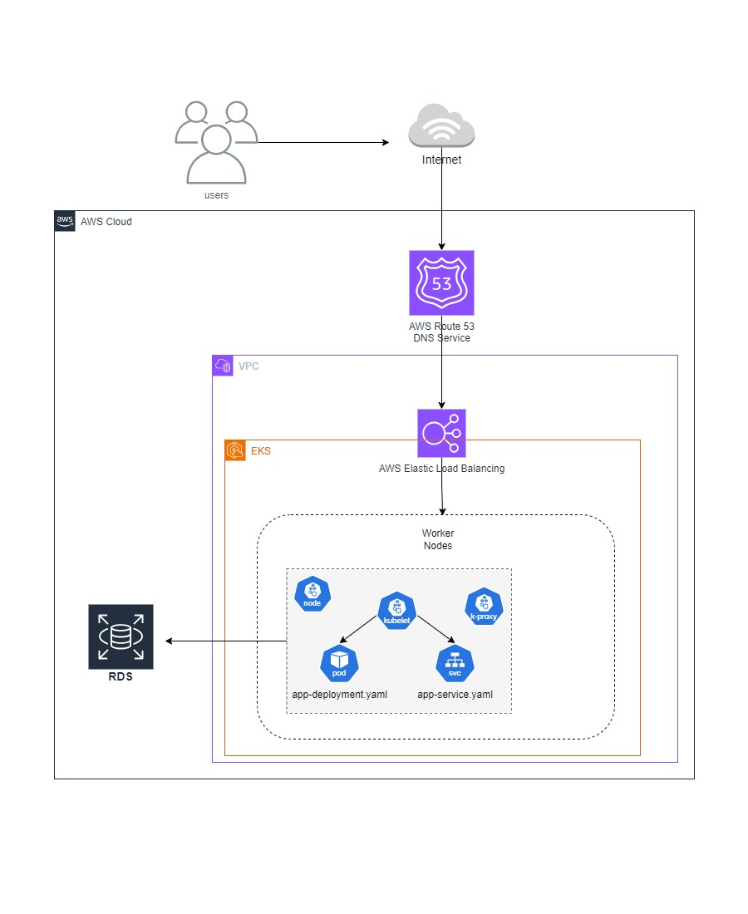
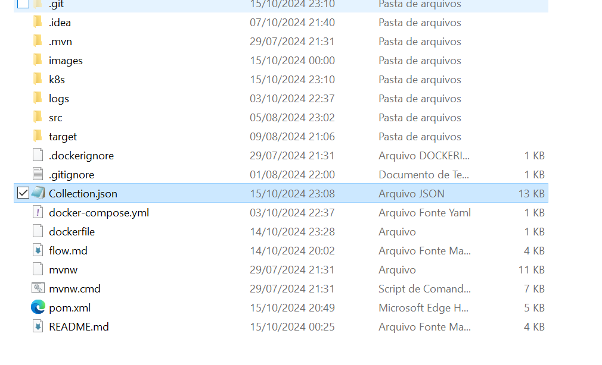

<h3 align="center">Fest Food API - Tech Challenge - 8SOAT FIAP</h3>

---

<p align="center"> Projeto Monolíto desenvolvido por alunos do Pós Tech - FIAP. Fase 1.
    <br> 
</p>

## 📝 Índice

- [Sobre](#about)
- [Documentação](#documentation)
- [Comece por aqui](#getting_started)
- [Ferramentas](#built_using)
- [Desenvolvedores](#authors)

## 🧐 Sobre <a name = "about"></a>

O projeto foi desenvolvido na linguagem JAVA, utilizando
projeto consiste em um Cardápio Digital e um Sistema de Gerenciamento de Pedidos para uma lanchonete. Onde o cliente é capaz de realizar um pedido, escolhendo todos os produtos desejados, e realizar o pagamento. O status do pedido é gerenciado pelo estabelecimento e acompanhado pelo cliente.

### Narrativa <a name = "about"></a>

O processo de pedido na lanchonete começa quando um cliente deseja fazer um pedido. O cliente entra na lanchonete, senta na mesa, pega o “cardápio digital”, sendo este um tablet. O cliente tem a opção de identificar-se no aplicativo ou não, após este processo é permitido a navegação pelo menu e a seleção do combo. Após selecionar o combo, o cliente finaliza o pedido e realiza o pagamento digitalmente.

Com o pagamento realizado, o pedido é enviado para o sistema da lanchonete e o status da pedido muda para ”recebido”. Quando o cozinheiro inicia a preparação, o status é alterado para “em preparação” e o cliente consegue acompanhar o andamento e o tempo de espera do pedido no “cardápio digital”.
Quando o pedido estiver pronto, o status é alterado para “pronto” e uma notificação é enviada para o cliente. O cliente vai até o balcão e retira o pedido. Após a retirada do pedido o status é alterado para “finalizado”.

### Documentação <a name = "documentation"></a>

Links da documentão gerada durante o planejamento do projeto.

- [Confluence](https://id.atlassian.com/invite/p/confluence?id=X4ymu_SWTfGAEA0D0241Qg) - Documentação.
- [Swagger](http://localhost:8080/swagger-ui/index.html#/) - Swagger.
- [Miro](https://miro.com/app/board/uXjVKzSNd0s=/) - Event Storming.

#### Arquitetura de Software <a name = "arquitetura de software"></a>

[]


## 🏁 Comece por aqui <a name = "getting_started"></a>

Comandos para rodar a API na máquina local para fins de desenvolvimento e teste.

### Container
Para rodar o projeto usando o contâiner, é necessário ter o Docker instalado.

1. execute o comando: `docker-compose up` na pasta do projeto;

### Kubernets
Para rodar o projeto usando o kubernet, é necessário seguir as etapas abaixo.

1. Instalar minikube. (Consulte: [Ferramentas](#built_using))

2. No powershell, como administrador, execute o seguinte comando:
```
$ minikube start --driver=hyperv
```
3. Entrar na pasta do projeto.
4. Execute no powershell, como administrador, os seguintes comandos:

```
$ & minikube -p minikube docker-env | Invoke-Expression
$ docker build -t gestaopedidos:latest .
$ kubectl apply -f app-deployment.yaml
$ kubectl apply -f app-service.yaml
$ kubectl get pods - ambos tem que estar Running e ready 1/1
$ minikube service gestaopedidos-service --url
```
4. O powershell retorna a url da aplicação.

### Collection
- Arquivo com a collection, contendo os exemplos de requisiçãoo do projeto, inserido na pasta raiz do projeto.

```
collection.json
```
- Arquivo com o fluxo de aquisições inserido na pasta raiz do projeto.
```
flow.md
```
[]


## ⛏️ Ferramentas <a name = "built_using"></a>

- [Postgree](https://www.postgresql.org/) - Banco de Dados.
- [Docker](https://www.docker.com/products/docker-desktop/) - Software de conteinerização.
- [Minikube](https://minikube.sigs.k8s.io/docs/) - Local Kubernets.
- [SpringBoot](https://spring.io/projects/spring-boot) - Framework.
- [Maven](https://maven.apache.org/) - Ferramenta de automação de compilação.
- [Intellij](https://www.jetbrains.com/idea/download/?section=windows) - IDE recomendada.

## ✍️ Desenvolvedores <a name = "authors"></a>

- Handryo Casali
- Nicole Escobar Alves
- Luis Henrique Carreira
- Victor Hugo Silva Lima

